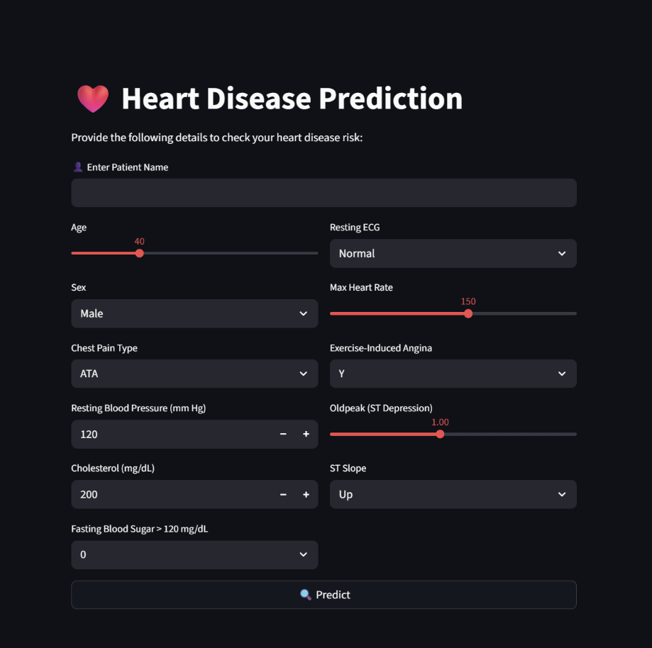

# Heart_Disease-ML
End-to-end Machine Learning project on Heart Disease Prediction.  Includes data preprocessing, EDA, model building, and deployment using Streamlit.  The app allows users to input health parameters and get instant predictions, showcasing practical ML and deployment skills.

# ❤️ Heart Disease Prediction System

An **end-to-end Machine Learning project** that predicts the risk of heart disease based on patient health parameters.
This project includes **data analysis, model building, evaluation, and deployment using Streamlit**.

---

## 🚀 Live Demo

👉 *https://heart-disease-0.streamlit.app/*

---

## 🖼️ Application Preview



---

## 📌 Project Overview

Heart disease is one of the leading causes of death worldwide.
This project aims to **assist in early detection** by using Machine Learning models trained on medical data.

Users can input patient details through an **interactive web interface**, and the system will predict the likelihood of heart disease.

---

## ⚙️ Features

* 🔍 User-friendly Streamlit interface
* 📊 Real-time prediction
* 🧠 Multiple ML models trained & compared
* 📈 Exploratory Data Analysis (EDA)
* ⚡ Fast and lightweight deployment

---

## 🧠 Machine Learning Models Used

| Model               | Accuracy (%) | F1 Score   |
| ------------------- | ------------ | ---------- |
| Logistic Regression | **86.96**    | **0.8846** |
| KNN                 | 86.41        | 0.8815     |
| Naive Bayes         | 84.78        | 0.8614     |
| SVM (RBF)           | 84.78        | 0.8667     |
| Decision Tree       | 81.52        | 0.8333     |

✅ **Best Model:** Logistic Regression (Highest Accuracy & F1 Score)

---

## 📊 Input Features

The model uses the following health parameters:

* Age
* Sex
* Chest Pain Type
* Resting Blood Pressure
* Cholesterol
* Fasting Blood Sugar
* Resting ECG
* Max Heart Rate
* Exercise-Induced Angina
* Oldpeak (ST Depression)
* ST Slope

---

## 🛠️ Tech Stack

### 👨‍💻 Programming Language

* Python

### 📚 Libraries Used

* numpy
* pandas
* matplotlib
* seaborn
* scikit-learn
* streamlit

---

## 📂 Project Structure

```
project/
│── app.py                # Streamlit application
│── model.pkl            # Trained ML model
│── requirements.txt     # Dependencies
│── data.csv             # Dataset
│── heart.png            # App screenshot
```

---

## ⚡ Installation & Setup

### 1️⃣ Clone the repository

```bash
git clone https://github.com/your-username/repo-name.git
cd repo-name
```

### 2️⃣ Install dependencies

```bash
pip install -r requirements.txt
```

### 3️⃣ Run the app

```bash
streamlit run app.py
```

---

## 🌐 Deployment

This project is deployed using **Streamlit Cloud**.

Steps:

1. Push code to GitHub
2. Connect repository to Streamlit Cloud
3. Deploy `app.py`

---


## 💡 Author

👤 Binit Robinson Kachhap
📧 **https://www.linkedin.com/in/binit-robinson-kachhap-808852380/**

---

⭐ If you like this project, don’t forget to **star the repository!**
